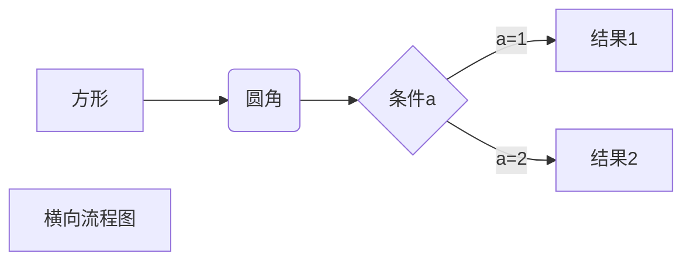
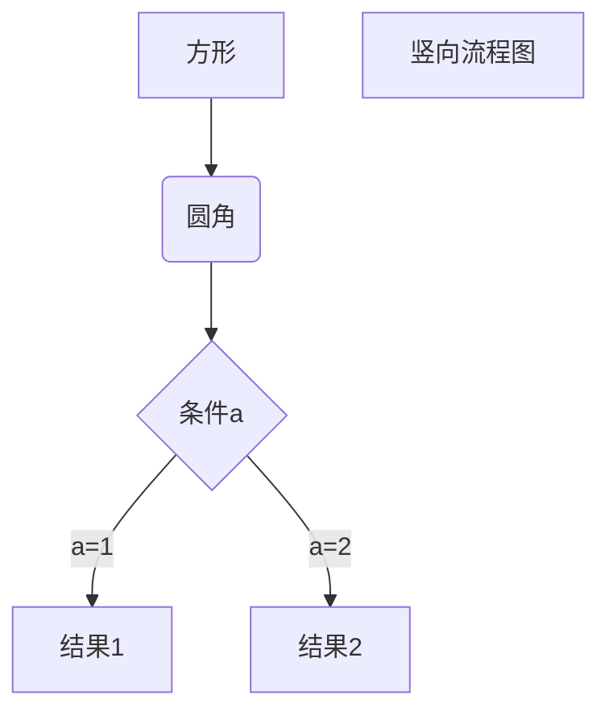
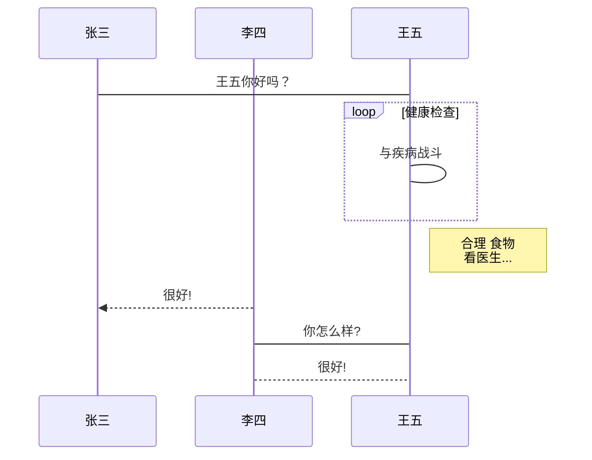
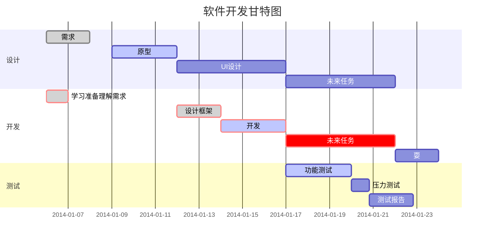

# 标题测试
## 标题测试
### 标题测试
#### 标题测试
##### 标题测试
###### 标题测试

---

# 文本测试

字体测试字体测试字体测试字体测试字体测试字体测试字体测试字体测试字体测试字体测试字体测试字体测试字体测试字体测试字体测试字体测试字体测试字体测试字体测试字体测试字体测试字体测试字体测试字体测试字体测试字体测试字体测试字体测试字体测试字体测试字体测试字体测试字体测试

---

ABCDEFGHIJKLMNOPQRSTUVWXYZ

abcdefghijklmnopqrstuvwxyz

0123456789

!@#$%^&*()_+-=[]{}|;':",./<>?

，。！？、；：“”‘’（）【】———

---

Lorem ipsum dolor sit amet, consectetur adipiscing elit. Suspendisse tincidunt, turpis ac congue tristique, lacus nulla lacinia sapien, sit amet consequat quam nibh vel magna. Duis et massa justo. Donec interdum blandit metus, eget euismod odio laoreet nec. Nunc ornare justo non elit dignissim, sed dignissim ex mattis. In nec nisi in justo faucibus facilisis eu eu mi. Pellentesque habitant morbi tristique senectus et netus et malesuada fames ac turpis egestas. Duis sollicitudin lorem et risus aliquet, at eleifend turpis luctus. Vivamus nec sapien eu libero iaculis ultricies ut id elit. Nunc scelerisque nisi non lorem luctus, sed rutrum orci iaculis. Sed vel lacus nec libero hendrerit faucibus. Nullam sed nunc ullamcorper, consectetur nisi vel, interdum nulla. Etiam sed ipsum in ex facilisis euismod sed nec nibh. Suspendisse potenti.


---
# Markdown 测试
 
排版
 
**粗体** *斜体* 
 
~~这是一段错误的文本。~~
 
引用:
 
> 引用Leanote官方的话, 为什么要做Leanote, 原因是...
 

## 列表

- 字体测试
  - 字体测试
    - 字体测试

1. 字体测试
2. 字体测试
3. 字体测试
   1. 字体测试
   2. 字体测试
   3. 字体测试
 
## 图片与链接
 
图片:


链接:
[这是去往Leanote官方博客的链接](https://leanote.leanote.com)
 
## 标题
 
以下是各级标题, 最多支持5级标题
 
```md
# 标题测试1
## 标题测试2
### 标题测试3
#### 标题测试4
##### 标题测试5
###### 标题测试6
```
 
## 代码
 
    代码块（左侧有八个不可见的空格）

代码块测试:

    function get(key) 
    {
        return m[key];
    }
    
代码高亮测试:
 
```c
// This is a simple implementation of the Bubble Sort algorithm in C++

#include <iostream>
using namespace std;

void bubbleSort(int arr[], int n)
{
    for (int i = 0; i < n - 1; i++)
        for (int j = 0; j < n - i - 1; j++)
            if (arr[j] > arr[j + 1])
                swap(arr[j], arr[j + 1]);
}

int main()
{
    int arr[] = {64, 34, 25, 12, 22, 11, 90};
    int n = sizeof(arr) / sizeof(arr[0]);
    bubbleSort(arr, n);
    cout << "Sorted array: ";
    for (int i = 0; i < n; i++)
        cout << arr[i] << " ";
    return 0;
}

```

``` javascript
/**
* nth element in the fibonacci series.
* @param n >= 0
* @return the nth element, >= 0.
*/
function fib(n) {
  var a = 1, b = 1;
  var tmp;
  while (--n >= 0) {
    tmp = a;
    a += b;
    b = tmp;
  }
  return a;
}
 
document.write(fib(10));
```
 
```python
class Employee:
   empCount = 0
 
   def __init__(self, name, salary):
        self.name = name
        self.salary = salary
        Employee.empCount += 1
```
 
 
## 表格
 
| Item     | Value  |
| -------- | ------ |
| Computer | \$1600 |
| Phone    | \$12   |
| Pipe     | \$1    |
 
可以指定对齐方式, 如Item列左对齐, Value列右对齐, Qty列居中对齐
 
| Item     |  Value |  Qty  |
| :------- | -----: | :---: |
| Computer | \$1600 |   5   |
| Phone    |   \$12 |  12   |
| Pipe     |    \$1 |  234  |
 
 
## 定义型列表
 
名词 1
:   定义 1（左侧有一个可见的冒号和四个不可见的空格）
 
 


## Html 标签
 
支持在 Markdown 语法中嵌套 Html 标签，譬如，你可以用 Html 写一个纵跨两行的表格：
 
    <table>
        <tr>
            <th rowspan="2">值班人员</th>
            <th>星期一</th>
            <th>星期二</th>
            <th>星期三</th>
        </tr>
        <tr>
            <td>李强</td>
            <td>张明</td>
            <td>王平</td>
        </tr>
    </table>
 
 
<table>
    <tr>
        <th rowspan="2">值班人员</th>
        <th>星期一</th>
        <th>星期二</th>
        <th>星期三</th>
    </tr>
    <tr>
        <td>李强</td>
        <td>张明</td>
        <td>王平</td>
    </tr>
</table>
 
**提示**, 如果想对图片的宽度和高度进行控制, 你也可以通过img标签, 如:
    ``

 
## 脚注
 
Leanote[^1]来创建一个脚注
  [^1]: Leanote是一款强大的开源云笔记产品.
 
## 目录
 
通过 `[TOC]` 在文档中插入目录, 如:
 
[TOC]
 
## 图象
 
1、横向流程图源码格式：


graph LR
A[方形] -->B(圆角)
    B --> C{条件a}
    C -->|a=1| D[结果1]
    C -->|a=2| E[结果2]
    F[横向流程图]


2、竖向流程图源码格式：


graph TD
A[方形] --> B(圆角)
    B --> C{条件a}
    C --> |a=1| D[结果1]
    C --> |a=2| E[结果2]
    F[竖向流程图]


3、标准流程图源码格式：

```flow
st=>start: 开始框
op=>operation: 处理框
cond=>condition: 判断框(是或否?)
sub1=>subroutine: 子流程
io=>inputoutput: 输入输出框
e=>end: 结束框
st->op->cond
cond(yes)->io->e
cond(no)->sub1(right)->op
```
st=>start: 开始框
op=>operation: 处理框
cond=>condition: 判断框(是或否?)
sub1=>subroutine: 子流程
io=>inputoutput: 输入输出框
e=>end: 结束框
st->op->cond
cond(yes)->io->e
cond(no)->sub1(right)->op

4、标准流程图源码格式（横向）：

```flow
st=>start: 开始框
op=>operation: 处理框
cond=>condition: 判断框(是或否?)
sub1=>subroutine: 子流程
io=>inputoutput: 输入输出框
e=>end: 结束框
st(right)->op(right)->cond
cond(yes)->io(bottom)->e
cond(no)->sub1(right)->op
```
st=>start: 开始框
op=>operation: 处理框
cond=>condition: 判断框(是或否?)
sub1=>subroutine: 子流程
io=>inputoutput: 输入输出框
e=>end: 结束框
st(right)->op(right)->cond
cond(yes)->io(bottom)->e
cond(no)->sub1(right)->op

5、UML时序图源码样例：

```sequence
对象A->对象B: 对象B你好吗?（请求）
Note right of 对象B: 对象B的描述
Note left of 对象A: 对象A的描述(提示)
对象B-->对象A: 我很好(响应)
对象A->对象B: 你真的好吗？
```
对象A->对象B: 对象B你好吗?（请求）
Note right of 对象B: 对象B的描述
Note left of 对象A: 对象A的描述(提示)
对象B-->对象A: 我很好(响应)
对象A->对象B: 你真的好吗？

6、UML时序图源码复杂样例：

```sequence
Title: 标题：复杂使用
对象A->对象B: 对象B你好吗?（请求）
Note right of 对象B: 对象B的描述
Note left of 对象A: 对象A的描述(提示)
对象B-->对象A: 我很好(响应)
对象B->小三: 你好吗
小三-->>对象A: 对象B找我了
对象A->对象B: 你真的好吗？
Note over 小三,对象B: 我们是朋友
participant C
Note right of C: 没人陪我玩
```
Title: 标题：复杂使用
对象A->对象B: 对象B你好吗?（请求）
Note right of 对象B: 对象B的描述
Note left of 对象A: 对象A的描述(提示)
对象B-->对象A: 我很好(响应)
对象B->小三: 你好吗
小三-->>对象A: 对象B找我了
对象A->对象B: 你真的好吗？
Note over 小三,对象B: 我们是朋友
participant C
Note right of C: 没人陪我玩

7、UML标准时序图样例：


%% 时序图例子,-> 直线，-->虚线，->>实线箭头
  sequenceDiagram
    participant 张三
    participant 李四
    张三->王五: 王五你好吗？
    loop 健康检查
        王五->王五: 与疾病战斗
    end
    Note right of 王五: 合理 食物 <br/>看医生...
    李四-->>张三: 很好!
    王五->李四: 你怎么样?
    李四-->王五: 很好!

8、甘特图样例：


%% 语法示例
        gantt
        dateFormat  YYYY-MM-DD
        title 软件开发甘特图
        section 设计
        需求                      :done,    des1, 2014-01-06,2014-01-08
        原型                      :active,  des2, 2014-01-09, 3d
        UI设计                     :         des3, after des2, 5d
    未来任务                     :         des4, after des3, 5d
        section 开发
        学习准备理解需求                      :crit, done, 2014-01-06,24h
        设计框架                             :crit, done, after des2, 2d
        开发                                 :crit, active, 3d
        未来任务                              :crit, 5d
        耍                                   :2d
        section 测试
        功能测试                              :active, a1, after des3, 3d
        压力测试                               :after a1  , 20h
        测试报告                               : 48h

> **提示:** 更多关于时序图与流程图的语法请参考:
 
> - [时序图语法](https://bramp.github.io/js-sequence-diagrams/)
> - [流程图语法](https://adrai.github.io/flowchart.js)
 
## MathJax 公式
 
`$` 表示行内公式： 
 
质能守恒方程可以用一个很简洁的方程式 $E=mc^2$ 来表达。
 
`$$` 表示整行公式：
 
$$\sum_{i=1}^n a_i=0$$
 
$$f(x_1,x_x,\ldots,x_n) = x_1^2 + x_2^2 + \cdots + x_n^2$$

错误的公式不会被渲染：
$$\sum^{j-1}_{k=0}{\widehat{\gamma}_{kj} z_k}$$

正确的`$$\sum_{k=0}^{j-1}{\widehat{\gamma}_{kj} z_k}$$`才会：
$$\sum_{k=0}^{j-1}{\widehat{\gamma}_{kj} z_k}$$

更复杂的公式:
$$
\begin{eqnarray}
\vec\nabla \times (\vec\nabla f) & = & 0  \cdots\cdots梯度场必是无旋场\\
\vec\nabla \cdot(\vec\nabla \times \vec F) & = & 0\cdots\cdots旋度场必是无散场\\
\vec\nabla \cdot (\vec\nabla f) & = & {\vec\nabla}^2f\\
\vec\nabla \times(\vec\nabla \times \vec F) & = & \vec\nabla(\vec\nabla \cdot \vec F) - {\vec\nabla}^2 \vec F\\
\end{eqnarray}
$$
 


访问 [MathJax](https://meta.math.stackexchange.com/questions/5020/mathjax-basic-tutorial-and-quick-reference) 参考更多使用方法。